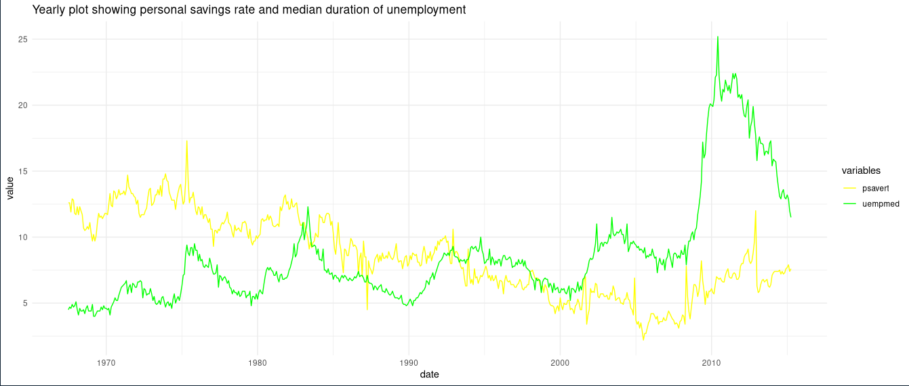

# Tests for the project "RSQLiteAdmin Visualisation Tools" in Google Summer of Code 2021

## 1. Easy Test

### Problem Statement

Install the package `rsqliteadmin` from CRAN and play around with all the features. Create a database, add a table and import some data. Edit, search and export it.


### Code

```

```
### Plot

Plot created is shown below:


## 2. Medium Test 1

### Problem Statement

Plot a time-series line chart on a dataset of your choice with different variables in a single chart. Customize it to make it clear and insightful.


In this test I have used the US `economics` time series dataset. Initially I have loaded the ggplot2 and set the minimalistic theme
### Code

```
> library(ggplot2)
> theme_set(theme_minimal())

> head(economics)
# A tibble: 6 x 6
  date         pce    pop psavert uempmed
  <date>     <dbl>  <dbl>   <dbl>   <dbl>
1 1967-07-01  507. 198712    12.6     4.5
2 1967-08-01  510. 198911    12.6     4.7
3 1967-09-01  516. 199113    11.9     4.6
4 1967-10-01  512. 199311    12.9     4.9
5 1967-11-01  517. 199498    12.8     4.7
6 1967-12-01  525. 199657    11.8     4.8
# … with 1 more variable: unemploy <dbl>
```
Using the `tidyverse` package to prepare the data and gather the two variables ‘psavert’ and ‘uempmed’ into key-value pairs.

```
library("tidyverse")
> # For data preparation
> library("tidyverse")
── Attaching packages ──────── tidyverse 1.3.0 ──
✓ tibble  3.1.0     ✓ dplyr   1.0.5
✓ tidyr   1.1.3     ✓ stringr 1.4.0
✓ readr   1.4.0     ✓ forcats 0.5.1
✓ purrr   0.3.4     
── Conflicts ─────────── tidyverse_conflicts() ──
x dplyr::filter() masks stats::filter()
x dplyr::lag()    masks stats::lag()
> df <- economics %>%
+     select(date, psavert, uempmed) %>%
+     gather(key = "variables", value = "value", -date)
> head(df)
# A tibble: 6 x 3
  date       variables value
  <date>     <chr>     <dbl>
1 1967-07-01 psavert    12.6
2 1967-08-01 psavert    12.6
3 1967-09-01 psavert    11.9
4 1967-10-01 psavert    12.9
5 1967-11-01 psavert    12.8
6 1967-12-01 psavert    11.8
```
Visualise the data showing personal savings rate and median duration of unemployment throughout the years using `geom_line()` from `ggplot2` package and customize them using `scale_color_manual()` and `ggtitle()` to further add data labels and titles to the plot respectively.

### Plot

Plot created by the above code is shown below:



## 3. Hard Test

### Problem Statement


### Code
```
```
### Output

I have attached the output screenshots to show the implementation of functions of the packages `calc` and `vectorfuncts`.


